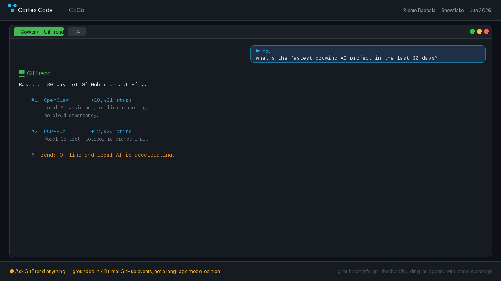

# Building AI Agents with Snowflake CoCo

Workshop materials for building a **production AI agent on 107 million real GitHub events** — with zero SQL written by hand.

Presented by [Richie Bachala](https://www.snowflake.com/en/blog/authors/richie-bachala/), Solutions Architecture Leader at Snowflake.

---

## 👉 Attending a live session?

Start with your event page — it has the signup link, timing, and pre-work specific to your session:

| Event | When | Where |
|---|---|---|
| [**ODSC AI × Snowflake — Build an AI Agent in <60 Min**](events/odsc-2026-08-06.md) | **Aug 6, 2026, 6:00 PM PT** | Mindspace, 575 Market St, San Francisco |
| [TechEquity AI Forum — Level 2](events/techequity-2026-07-28.md) | Jul 28, 2026 *(past)* | Snowflake SVAI Hub, Menlo Park |

> **⚠️ Trial signup links are event-specific and time-boxed.** They activate the AI features this workshop needs, and only for accounts created inside a short window around the event. Always use the link on *your* event page — a generic trial won't have what you need.

Working through this on your own? Grab a [free Snowflake trial](https://signup.snowflake.com/) and follow the guide — everything works, you just won't get the pre-enabled AI feature flags.

---

## Pre-Work

### Install the CoCo CLI

This workshop runs in the **CoCo CLI**, not the Snowsight UI.

**macOS / Linux / WSL:**
```bash
curl -LsS https://ai.snowflake.com/static/cc-scripts/install.sh | sh
```

**Windows (PowerShell):**
```powershell
irm https://ai.snowflake.com/static/cc-scripts/install.ps1 | iex
```

Confirm the install: `cortex --version`

### Get a Snowflake account

Use the event-specific link on your event page above.

---

## Why CoCo

General-purpose AI coding tools start blind to your schemas, roles, and warehouses. They burn time and tokens interrogating you before they can build anything.

CoCo starts with your data context already in hand. That's the whole difference, and you'll feel it in the first five minutes.

---

## What You'll Build

**GitTrend** — an AI agent grounded in 107M real GitHub events.



Ask it:
- *"What's the fastest-growing AI project in the last 30 days?"*
- *"Is there anything blowing up around MCP or agentic AI this month?"*
- *"Show me a bar chart of the top 10 repos by stars."*

CoCo writes every SQL statement. You direct it. You own the result.

---

## The 5-Step Pattern

```
1. Set the context   →  AGENTS.md + cortex CLI; CoCo learns your account
2. Load the data     →  107M GitHub events via COPY INTO from public S3
3. Explore & build   →  CoCo reads the schema, builds V_TRENDING_AI_REPOS
4. Add intelligence  →  AI_COMPLETE summaries + Cortex Search Service
5. Wire the agent    →  Cortex Agent = GitTrend, ready to answer questions
```

**Stretch (take-home):** expose GitTrend as an **MCP Server** and query it from Claude Desktop, Cursor, or VS Code.

The same pattern works on any dataset in your organization. Swap `GITHUB_EVENTS` for your support tickets, sales pipeline, or product telemetry — same prompts, different schema.

---

## The Stack

```
GITTREND_DB.PUBLIC.GITHUB_EVENTS  →  107M real GitHub events (public S3)
CoCo CLI                          →  writes the code (your terminal)
V_TRENDING_AI_REPOS               →  trending AI repos by star activity
AI_COMPLETE                       →  turns SQL results into language
GITHUB_REPO_SEARCH                →  Cortex Search Service (semantic index)
GITTREND                          →  Cortex Agent (search + chart + system prompt)
GITTREND_MCP                      →  MCP Server (stretch) — exposes GitTrend anywhere
```

---

## Repo Contents

| File | What it is |
|---|---|
| [`WORKSHOP-GUIDE.md`](WORKSHOP-GUIDE.md) | Step-by-step build guide — follow this during the session |
| [`CHECKPOINTS.sql`](CHECKPOINTS.sql) | Fallback SQL for every step — use if CoCo gets stuck |
| [`events/`](events/) | Per-event details: date, venue, signup link, timing |
| [`sample_weekly_digest_skill.md`](sample_weekly_digest_skill.md) | Example Agent Skill to extend GitTrend |
| [`media/`](media/) | Deck PDF, demo recordings, screenshots |

---

## Resources

- [Snowflake-managed MCP Server docs](https://docs.snowflake.com/en/user-guide/snowflake-cortex/cortex-agents-mcp)
- [CoCo CLI documentation](https://docs.snowflake.com/en/user-guide/cortex-code/cortex-code-snowsight)
- [Getting Started with Cortex Agents](https://www.snowflake.com/en/developers/guides/getting-started-with-cortex-agents/)
- [Getting Started with the Snowflake MCP Server](https://www.snowflake.com/en/developers/guides/getting-started-with-snowflake-mcp-server/)
- [Getting Started with Snowflake Cortex AI](https://quickstarts.snowflake.com/guide/getting-started-with-snowflake-cortex-ai/)

---

## About the Presenter

**Richie Bachala** — Solutions Architecture Leader, Snowflake
[Blog](https://www.snowflake.com/en/blog/authors/richie-bachala/) · [LinkedIn](https://www.linkedin.com/in/richiebachala/)
